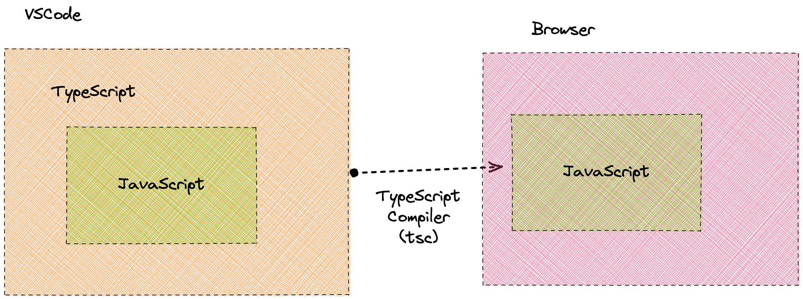

# Minimal TypeScript example

TypeScript is a super set of JavaScript. It adds static typing to JavaScript. TypeScript is compiled to JavaScript.



## Run

1. Install the typescript dependency by running `npm install` in this folder
2. Run `npm run build` to compile the typescript file to javascript
3. Run `node index.js` to run the compiled application

## What?

This codebase demonstrates how the TypeScript compiler `tsc` compiles `index.ts` (using modern JavaScript syntax)

```ts
type Person = {
  name: string;
  age?: number;
};
const person1 = {
  name: "Andre",
  age: 16,
};

const getPersonDetails = (person: Person) => {
  return person.age !== undefined
    ? `${person.name}: ${person.age} years`
    : person.name;
};

console.log(getPersonDetails(person1));
```

into the following JavaScript file `index.js` (ECMAScript version 3 - published in December 2009):

```js
"use strict";
var person1 = {
    name: "Andre",
    age: 16
};
var getPersonDetails = function (person) {
    return person.age !== undefined
        ? "".concat(person.name, ": ").concat(person.age, " years")
        : person.name;
};
console.log(getPersonDetails(person1));
```

## Overview

Running `yarn build-and-run` combines two commands which do the following:

1. `tsc --project .`: Run the TypeScript compiler `tsc` to compile `index.ts` (TypeScript) to `index.js` (JavaScript).
2. `node index.js`: The node script `index.js` is then directly run in the command line.

## Things to play around with

### Change ECMAScript target version of TypeScript compiler

1. In `tsconfig.json` change `"target": "ES3",` to `"target": "ES6",`
2. Run the `build-and-run` script (i.e. `yarn build-and-run`)
3. Which differences do you observe in `index.js`?

### How does TypeScript compile an `enum` ?

1. In `index.ts` add the following enum:

    ```ts
    enum Lang {
      "en",
      "de",
      "zh",
    }

    const lang = Lang.en;
    ```

2. Run the `build` script (i.e. `yarn build`);
3. What appeared in `index.js`?
